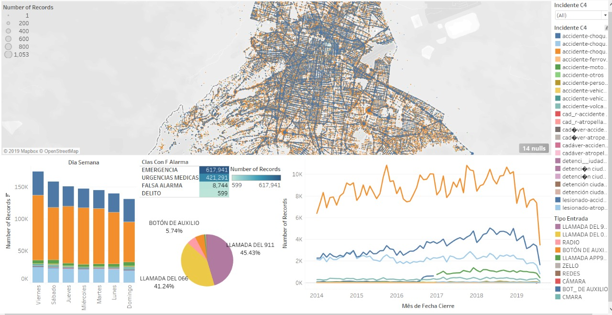

# OnTrack Project

<h2>Project Description:</h2>

A flask based full stack dashboard project for analyzing traffic incidents.

<h2>C5ers Team Members:</h2>
<ul>
  <li>Bruno Miranda;</li>
  <li>Gonzalo Cienfuegos;</li>
  <li>Jesica Tapia Reyes;</li>
  <li>Jose Amieva.</li>
</ul>

<h2>Main Objective:</h2>

Construct a Visual Performance dashboard with CDMX C5 data that provides meaningful insights about the city situation.

<h2>Story:</h2>

Current display of C5’s data is not actionable not for the authorities nor the citizens. In order to have a breakthrough on this, our project enables both parties to use the data on a meaningful way.

<h2>Objectives Development:</h2>
<ul>
  <li>Clean/Combine the data just for special characters;</li>
  <li>Categories: emergencies; medical emergencies, fake calls, crime;</li>
  <li>Allow the user to filter the information categories to find by themselves the desired insights.</li>
</ul>

<h2>Scope</h2>
<ul>
  <li><h3>MAP</h3>
    
The initial map as heatmap of overall incidents, than can be filtered by the categories desired; can be scrolled or selected by county and filtered by the main categories in every layer of itOverall city incidents but when clicked in an specific zone, it zooms in and clusters the incidents.

  </li>
  <li><h3>KPI summary for the desired date window</h3>
    <ul>
      <li>Quantity per active zone;</li>
      <li>Average time of resolution;</li>
      <li>Number of Deaths;</li>
      <li>Crimes</li>
    </ul>
  </li>
  <li><h3>TRENDS GRAPH</h3>
    
Overall data line plot with filters for all the categories and timeline available.

  </li>
</ul>

<h2>Data Sources:</h2>
  <li><a href=https://datos.cdmx.gob.mx/explore/dataset/incidentes-viales-c5/export/>C5 Export Data page</a></li>
